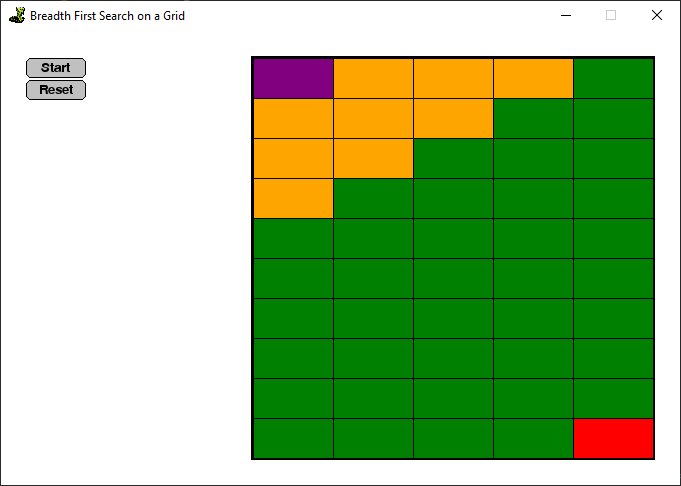

# Searching Algorithms Visualiser in Python

A visualisation tool for searching algorithms within a 2d grid. Currently only covers Breadth-First Search.

Uses `SimpleGUICS2Pygame`, which is based on both `pygame` and CodeSkulptor's `simplegui` module.

